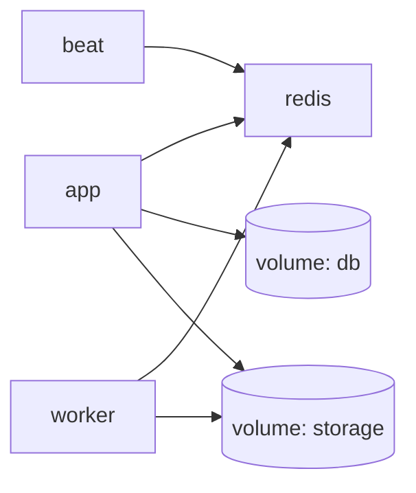

# Docker Compose

## Services



| Service | Image / build | Purpose |
|---------|---------------|---------|
| **app** | Dockerfile | FastAPI + static |
| **worker** | Dockerfile | Celery worker |
| **beat** | Dockerfile | Celery Beat (backup, self-heal) |
| **redis** | redis:7-alpine | Broker, cache |

## Files

| File | Purpose |
|------|---------|
| `docker-compose.yml` | Local development |
| `docker-compose.prod.yml` | Production VPS |
| `Dockerfile` | Multi-stage build |

## Local run

```bash
cp .env.example .env
# Edit SECRET_KEY, AGE keys

docker compose up -d --build
docker compose logs -f app
```

Application: http://localhost:8000

## Production

```bash
docker compose -f docker-compose.prod.yml up -d --build
```

## Volumes

| Volume | Path | Data |
|--------|------|------|
| `./medinsight.db` or named | DB | |
| `./storage` | Documents, DICOM | |
| `./backups` | Archives | |

!!! warning
    Do not delete volumes on `docker compose down` without a backup.

## Variables in compose

Passed via `env_file: .env` or `environment:` in the compose file.

!!! warning "Restart vs recreate"
    `docker compose restart app` does **not** reload new keys from `.env`.
    Use `docker compose up -d --force-recreate app celery_worker` or `./deploy.sh production`.

## Build

Dockerfile optimized for VPS:

- `PIP_DEFAULT_TIMEOUT=300`
- `PIP_RETRIES=5`

## Useful commands

```bash
# Rebuild one service
docker compose build app

# Shell in container
docker compose exec app bash

# Migrations
docker compose exec app alembic upgrade head
# or legacy (ALEMBIC_ENABLED=false): schema init runs in deploy.sh

# Cleanup (without volumes)
./scripts/docker_cleanup.sh deploy
```

## Healthcheck

```yaml
healthcheck:
  test: ["CMD", "curl", "-f", "http://localhost:8000/health/ready"]
  interval: 30s
  timeout: 10s
  retries: 3
```

## Ports

| Service | Host:Container |
|---------|----------------|
| app | 8000:8000 |
| redis | 6379 (internal) |
