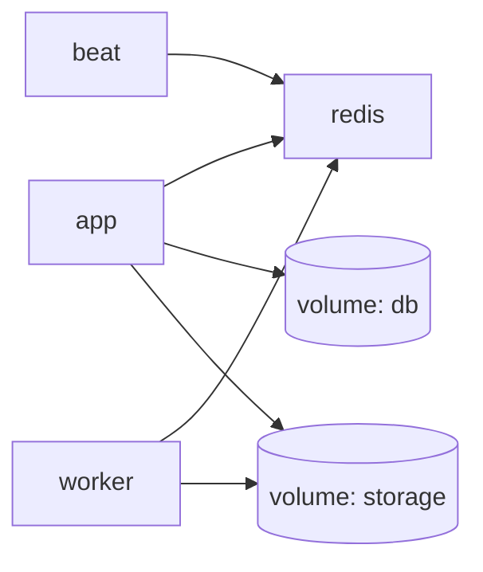

# Docker Compose

## Сервисы



| Сервис | Образ / build | Назначение |
|--------|---------------|------------|
| **app** | Dockerfile | FastAPI + static |
| **worker** | Dockerfile | Celery worker |
| **beat** | Dockerfile | Celery Beat (бэкап, self-heal) |
| **redis** | redis:7-alpine | Брокер, кэш |

## Файлы

| Файл | Назначение |
|------|------------|
| `docker-compose.yml` | Локальная разработка |
| `docker-compose.prod.yml` | Продакшен VPS |
| `Dockerfile` | Multi-stage build |

## Локальный запуск

```bash
cp .env.example .env
# Отредактируйте SECRET_KEY, AGE keys

docker compose up -d --build
docker compose logs -f app
```

Приложение: http://localhost:8000

## Продакшен

```bash
docker compose -f docker-compose.prod.yml up -d --build
```

## Volumes

| Volume | Путь | Данные |
|--------|------|--------|
| `./medinsight.db` или named | БД | |
| `./storage` | Документы, DICOM | |
| `./backups` | Архивы | |

!!! warning
    Не удаляйте volumes при `docker compose down` без бэкапа.

## Переменные в compose

Передаются через `env_file: .env` или `environment:` в compose-файле.

!!! warning "Перезапуск vs пересоздание"
    `docker compose restart app` не подхружает новые ключи из `.env`.
    Используйте `docker compose up -d --force-recreate app celery_worker`
    или `./deploy.sh production`.

## Сборка

Dockerfile оптимизирован для VPS:

- `PIP_DEFAULT_TIMEOUT=300`
- `PIP_RETRIES=5`

## Полезные команды

```bash
# Пересборка одного сервиса
docker compose build app

# Shell в контейнере
docker compose exec app bash

# Миграции (legacy или Alembic)
docker compose exec app bash -c 'python scripts/run_alembic_migrate.py'  # если ALEMBIC_ENABLED=true
# иначе deploy.sh / lifespan применяют create_all + app/db/migrations

# Очистка (без volumes)
./scripts/docker_cleanup.sh deploy
```

## Healthcheck

```yaml
healthcheck:
  test: ["CMD", "curl", "-f", "http://localhost:8000/health/ready"]
  interval: 30s
  timeout: 10s
  retries: 3
```

## Порты

| Сервис | Host:Container |
|--------|----------------|
| app | 8000:8000 |
| redis | 6379 (internal) |
