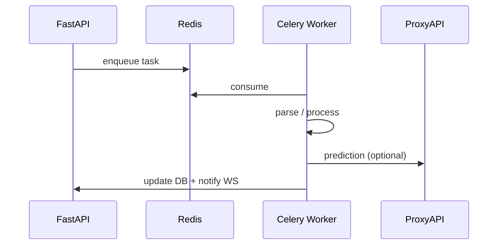

# AI Agents and Background Workers

## Concept

In MedInsight, “agents” are **Celery tasks** and **services** that run autonomous work: parsing, predictions, DICOM, backups.



## Celery application

File: `app/celery_app.py`

```python
celery_app = Celery("medinsight")
celery_app.conf.include = [
    "app.tasks.document_task",
    "app.tasks.prediction_task",
    "app.tasks.dicom_task",
    "app.tasks.backup_task",
    "app.tasks.self_heal_task",
]
```

## Tasks

### document_task — document parsing

1. Decrypt file (age).
2. Extract text (PDF/DOCX).
3. NLP: diagnoses, medications (`app/services/document_parser.py`).
4. Save `ParsedData`, status `parsed`.
5. WebSocket notification.

### prediction_task — predictions

1. Gather patient context + parsed data.
2. Call GPT via ProxyAPI (`app/services/gpt_service.py`).
3. On error — rule-based fallback.
4. Save `Prediction`, notify.

### dicom_task — DICOM

1. Decrypt `.dcm`.
2. Parse metadata (`app/services/dicom_parser.py`).
3. Generate PNG frames (`app/services/dicom_viewer.py`).
4. Encrypt and save.

### backup_task — backup

Archive DB + storage → age → `backups/`.

### self_heal_task — self-healing

Check Redis, restart stuck tasks (see [Self-healing](self-healing.md)).

## GPT service

`app/services/gpt_service.py`:

- prompt with clinical context;
- parse JSON response (risks + explanation);
- timeout and retry.

## Local run

```bash
# Terminal 1
uvicorn app.main:app --reload

# Terminal 2
celery -A app.celery_app worker -l info

# Terminal 3 (optional)
celery -A app.celery_app beat -l info
```

Docker:

```bash
docker compose up app worker beat redis
```

## Task monitoring

```bash
celery -A app.celery_app inspect active
celery -A app.celery_app inspect registered
```

## Adding a new task

1. Create `app/tasks/my_task.py` with `@celery_app.task`.
2. Add to `celery_app.conf.include`.
3. Call `.delay()` or `.apply_async()` from route/service.
4. Add a test in `scripts/`.
