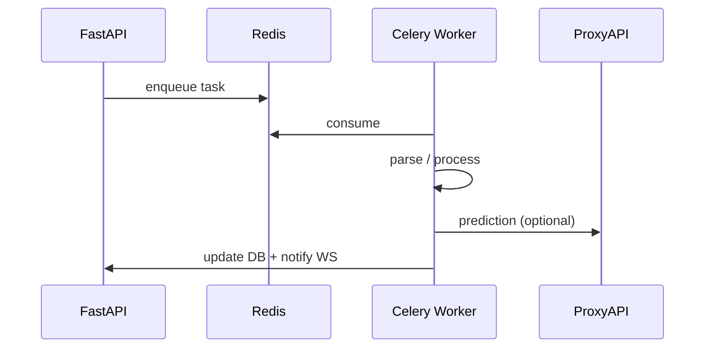

# AI-агенты и фоновые воркеры

## Концепция

В MedInsight «агенты» — это **Celery-задачи** и **сервисы**, выполняющие автономную работу: парсинг, прогнозы, DICOM, бэкапы.



## Celery-приложение

Файл: `app/celery_app.py`

```python
celery_app = Celery("medinsight")
celery_app.conf.include = [
    "app.tasks.document_task",
    "app.tasks.prediction_task",
    "app.tasks.dicom_task",
    "app.tasks.backup_task",
    "app.tasks.self_heal_task",
]
```

## Задачи

### document_task — парсинг документов

1. Расшифровать файл (age).
2. Извлечь текст (PDF/DOCX).
3. NLP: диагнозы, лекарства (`app/services/document_parser.py`).
4. Сохранить `ParsedData`, статус `parsed`.
5. WebSocket-уведомление.

### prediction_task — прогнозы

1. Собрать контекст пациента + parsed data.
2. Вызвать GPT через ProxyAPI (`app/services/gpt_service.py`).
3. При ошибке — rule-based fallback.
4. Сохранить `Prediction`, уведомить.

### dicom_task — DICOM

1. Расшифровать `.dcm`.
2. Парсинг метаданных (`app/services/dicom_parser.py`).
3. Генерация PNG-кадров (`app/services/dicom_viewer.py`).
4. Шифрование и сохранение.

### backup_task — бэкап

Архив БД + storage → age → `backups/`.

### self_heal_task — самовосстановление

Проверка Redis, перезапуск зависших задач (см. [Self-healing](self-healing.md)).

## GPT-сервис

`app/services/gpt_service.py`:

- промпт с клиническим контекстом;
- парсинг JSON-ответа (риски + explanation);
- таймаут и retry.

## Запуск локально

```bash
# Terminal 1
uvicorn app.main:app --reload

# Terminal 2
celery -A app.celery_app worker -l info

# Terminal 3 (опционально)
celery -A app.celery_app beat -l info
```

Docker:

```bash
docker compose up app worker beat redis
```

## Мониторинг задач

```bash
celery -A app.celery_app inspect active
celery -A app.celery_app inspect registered
```

## Добавление новой задачи

1. Создать `app/tasks/my_task.py` с `@celery_app.task`.
2. Добавить в `celery_app.conf.include`.
3. Вызвать `.delay()` или `.apply_async()` из route/service.
4. Добавить тест в `scripts/`.
