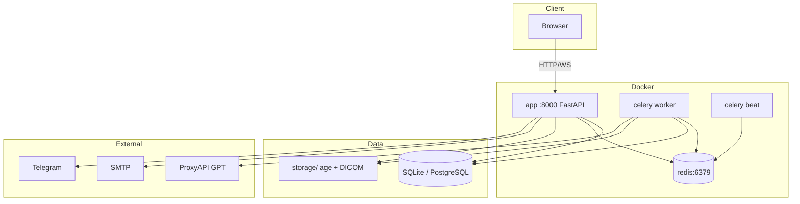

# Architecture

## Overview

MedInsight is a monolithic FastAPI application with Celery async tasks, SQLite/PostgreSQL, Redis, and a static frontend (Vanilla JS).

## Application layers

| Layer | Directory | Responsibility |
|-------|-------------|----------------|
| Routes | `app/routes/` | HTTP API, validation |
| Services | `app/services/` | Business logic |
| Models | `app/models.py` | SQLAlchemy ORM |
| Tasks | `app/tasks/` | Celery (parsing, DICOM, backup) |
| Static | `app/static/` | HTML/JS/CSS |
| Auth | `app/auth.py` | JWT, registration |
| Access | `app/services/access.py` | RBAC |

## Multi-tenancy

Each clinic is a **Tenant** with a unique `subdomain`. All requests are filtered by `tenant_id` from the JWT.

## RBAC

7 roles: `admin`, `head_of_department`, `doctor`, `nurse`, `researcher`, `viewer`, `superadmin`.

Checks in `app/services/access.py`:

- `can_read_patient`, `can_write_patient`
- `can_upload_document`, `can_delete_user`
- anonymization for `researcher`

## Async tasks

| Task | File | Purpose |
|------|------|---------|
| `parse_document` | `document_task.py` | PDF/DOCX → text, diagnoses |
| `process_dicom` | `dicom_task.py` | DICOM → series, PNG |
| `run_prediction` | `prediction_task.py` | GPT / fallback |
| `run_backup` | `backup_task.py` | age archive |
| `self_heal` | `self_heal_task.py` | Redis/Celery health |

## Encryption

Document and DICOM files are encrypted with **age** before writing to disk (`app/services/encryption.py`).

## WebSocket

`/ws/notifications` — push when documents, predictions, or DICOM are ready.

## Frontend

SPA-like pages without a framework:

- `index.html` + `dashboard.js`
- `login.html`, `admin.html`
- `dicom.html`, `dicom-viewer.html`

## CI/CD

GitHub Actions → SSH VPS → `deploy.sh production`.

## Related documents

- [Database schema](database-schema.md)
- [Agents](agents.md)
- [Self-healing](self-healing.md)
