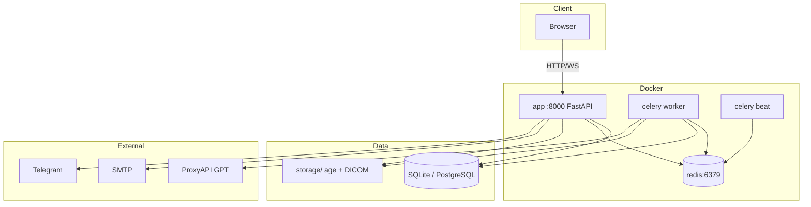

# Архитектура

## Обзор

MedInsight — монолитное FastAPI-приложение с асинхронными задачами Celery, SQLite/PostgreSQL, Redis и статическим фронтендом (Vanilla JS).

## Слои приложения

| Слой | Каталог | Ответственность |
|------|---------|-----------------|
| Routes | `app/routes/` | HTTP API, валидация |
| Services | `app/services/` | Бизнес-логика |
| Models | `app/models.py` | SQLAlchemy ORM |
| Tasks | `app/tasks/` | Celery (парсинг, DICOM, бэкап) |
| Static | `app/static/` | HTML/JS/CSS |
| Auth | `app/auth.py` | JWT, регистрация |
| Access | `app/services/access.py` | RBAC |

## Мультитенантность

Каждая клиника — **Tenant** с уникальным `subdomain`. Все запросы фильтруются по `tenant_id` из JWT.

## RBAC

7 ролей: `admin`, `head_of_department`, `doctor`, `nurse`, `researcher`, `viewer`, `superadmin`.

Проверки в `app/services/access.py`:

- `can_read_patient`, `can_write_patient`
- `can_upload_document`, `can_delete_user`
- анонимизация для `researcher`

## Асинхронные задачи

| Задача | Файл | Назначение |
|--------|------|------------|
| `parse_document` | `document_task.py` | PDF/DOCX → текст, диагнозы |
| `process_dicom` | `dicom_task.py` | DICOM → серии, PNG |
| `run_prediction` | `prediction_task.py` | GPT / fallback |
| `run_backup` | `backup_task.py` | age-архив |
| `self_heal` | `self_heal_task.py` | Redis/Celery health |

## Шифрование

Файлы документов и DICOM шифруются **age** перед записью на диск (`app/services/encryption.py`).

## WebSocket

`/ws/notifications` — push о готовности документов, прогнозов, DICOM.

## Frontend

SPA-подобные страницы без фреймворка:

- `index.html` + `dashboard.js`
- `login.html`, `admin.html`
- `dicom.html`, `dicom-viewer.html`

## CI/CD

GitHub Actions → SSH VPS → `deploy.sh production`.

## Связанные документы

- [Схема БД](database-schema.md)
- [Агенты](agents.md)
- [Self-healing](self-healing.md)
