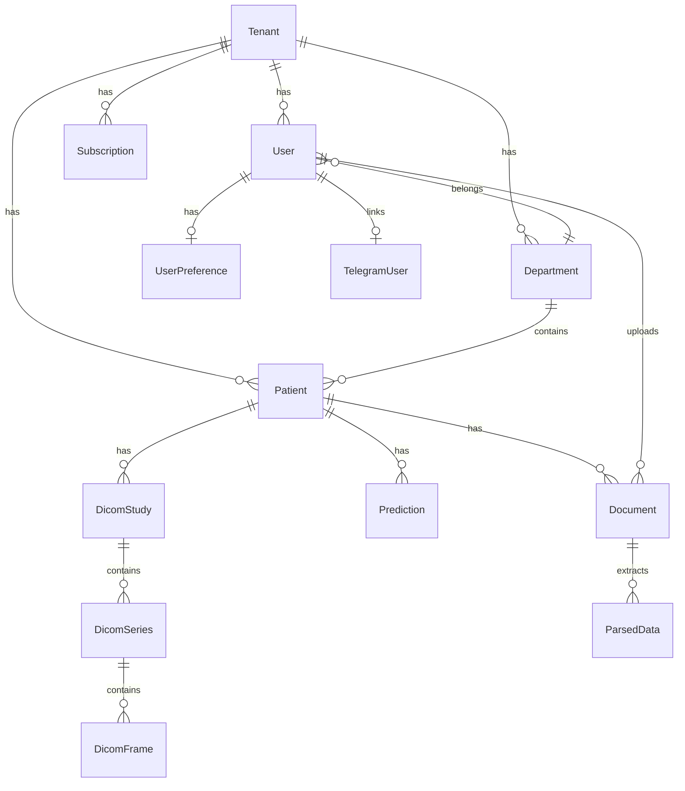

# Database Schema

## ER diagram (main entities)



## Main tables

### tenants

| Field | Type | Description |
|-------|------|-------------|
| id | INTEGER PK | |
| name | VARCHAR | Clinic name |
| subdomain | VARCHAR UNIQUE | Login subdomain |

### users

| Field | Type | Description |
|-------|------|-------------|
| id | INTEGER PK | |
| tenant_id | FK | Clinic |
| email | VARCHAR UNIQUE | |
| role | ENUM | RBAC role |
| department_id | FK nullable | Department |
| hashed_password | VARCHAR | bcrypt |

### patients

| Field | Type | Description |
|-------|------|-------------|
| id | INTEGER PK | |
| tenant_id | FK | |
| department_id | FK | |
| full_name | VARCHAR | Encrypted when required |
| date_of_birth | DATE | |
| attending_doctor_id | FK nullable | |

### documents

| Field | Type | Description |
|-------|------|-------------|
| id | INTEGER PK | |
| patient_id | FK | |
| file_path | VARCHAR | Encrypted path |
| status | ENUM | uploaded/processing/parsed/failed |
| document_type | VARCHAR | |

### dicom_studies / dicom_series / dicom_frames

DICOM hierarchy: Study → Series → Frame (PNG preview).

### predictions

| Field | Type | Description |
|-------|------|-------------|
| readmission_risk | FLOAT | 0–1 |
| complication_risk | FLOAT | 0–1 |
| risk_level | VARCHAR | low/medium/high |
| gpt_explanation | TEXT | |

## Migrations

SQL files in `app/db/migrations/` (001–014+).

Applied on deploy:

```bash
python -m app.db.migrate
```

## Schema generation

Alembic (if configured) or inspect models:

```bash
grep "^class " app/models.py
```

## Indexes

- `patients(tenant_id, department_id)`
- `documents(patient_id, status)`
- `dicom_studies(patient_id, study_uid)`

## Anonymization (researcher)

In `access.py`, fields `full_name`, `phone`, `email` are replaced with `P-{id} ANON` during serialization.
