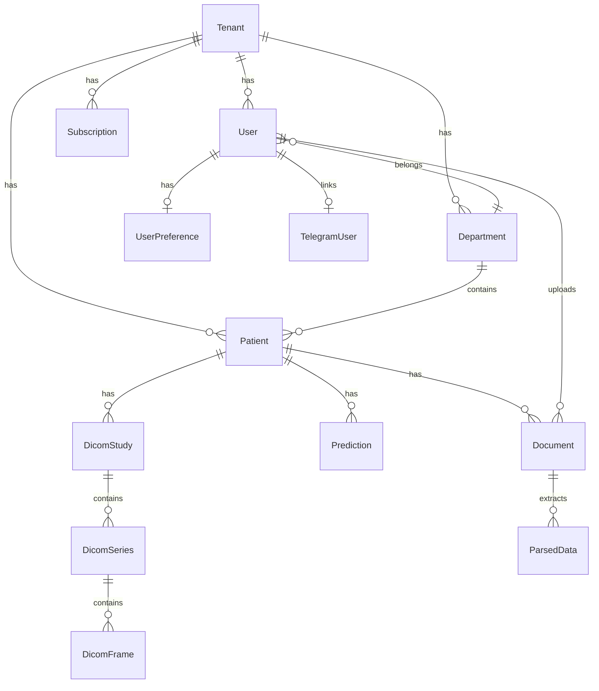

# Схема базы данных

## ER-диаграмма (основные сущности)



## Основные таблицы

### tenants

| Поле | Тип | Описание |
|------|-----|----------|
| id | INTEGER PK | |
| name | VARCHAR | Название клиники |
| subdomain | VARCHAR UNIQUE | Поддомен для входа |

### users

| Поле | Тип | Описание |
|------|-----|----------|
| id | INTEGER PK | |
| tenant_id | FK | Клиника |
| email | VARCHAR UNIQUE | |
| role | ENUM | RBAC-роль |
| department_id | FK nullable | Отделение |
| hashed_password | VARCHAR | bcrypt |

### patients

| Поле | Тип | Описание |
|------|-----|----------|
| id | INTEGER PK | |
| tenant_id | FK | |
| department_id | FK | |
| full_name | VARCHAR | Шифруется при необходимости |
| date_of_birth | DATE | |
| attending_doctor_id | FK nullable | |

### documents

| Поле | Тип | Описание |
|------|-----|----------|
| id | INTEGER PK | |
| patient_id | FK | |
| file_path | VARCHAR | Зашифрованный путь |
| status | ENUM | uploaded/processing/parsed/failed |
| document_type | VARCHAR | |

### dicom_studies / dicom_series / dicom_frames

Иерархия DICOM: Study → Series → Frame (PNG preview).

### predictions

| Поле | Тип | Описание |
|------|-----|----------|
| readmission_risk | FLOAT | 0–1 |
| complication_risk | FLOAT | 0–1 |
| risk_level | VARCHAR | low/medium/high |
| gpt_explanation | TEXT | |

## Миграции

SQL-файлы в `app/db/migrations/` (001–014+).

Применение при деплое:

```bash
python -m app.db.migrate
```

## Генерация схемы

Alembic (если настроен) или просмотр моделей:

```bash
grep "^class " app/models.py
```

## Индексы

- `patients(tenant_id, department_id)`
- `documents(patient_id, status)`
- `dicom_studies(patient_id, study_uid)`

## Анонимизация (researcher)

В `access.py` поля `full_name`, `phone`, `email` заменяются на `P-{id} ANON` при сериализации.
