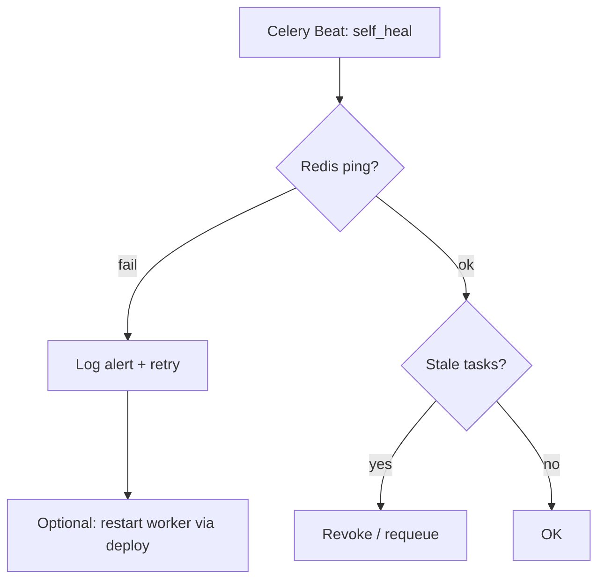

# Self-healing

Automatic recovery when Redis, Celery, or “stuck” tasks fail.

## Why

On a VPS with limited RAM (1.9 GB), the worker may crash or lose connection to Redis. Self-healing reduces downtime without manual intervention.

## Components

| Component | File |
|-----------|------|
| Celery Beat task | `app/tasks/self_heal_task.py` |
| Health checks | `app/routes/health.py` |
| Docker cleanup script | `scripts/docker_cleanup.sh` |

## Algorithm



1. **Ping Redis** — if unavailable, log + metric.
2. **Check stuck tasks** — tasks in `processing` > N minutes are marked failed or restarted.
3. **Health endpoint** — `/health/ready` reflects state for external monitoring.

## Schedule

Configured in Celery Beat (default every 5–15 minutes).

## Manual recovery

```bash
docker compose -f docker-compose.prod.yml restart redis worker
curl -s localhost:8000/health/ready
```

## Docker cleanup

`scripts/docker_cleanup.sh`:

- **deploy** — after deploy, removes dangling images;
- **weekly** — cron, without `--volumes`.

!!! warning
    Never use `docker system prune -f --volumes` on production — it removes volume data.

## Swap (optional)

`scripts/setup_swap.sh` — 4 GB swap, swappiness=10 for low-RAM VPS.

## Alerts

Configure external monitoring on `/health/ready` and alert on 3+ consecutive failures.

## Extension

To add checks:

1. Add a function in `self_heal_task.py`.
2. Register in beat schedule.
3. Cover with a test in `scripts/test_health.py`.
