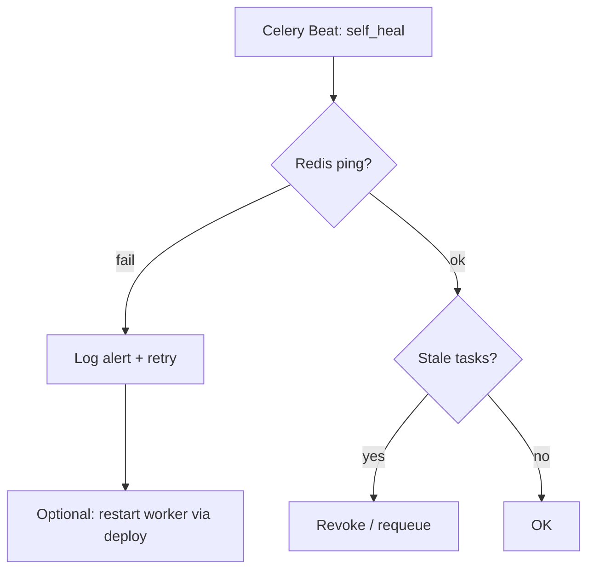

# Self-healing

Механизм автоматического восстановления при сбоях Redis, Celery или «зависших» задач.

## Зачем

На VPS с ограниченной RAM (1.9 GB) worker может падать или терять связь с Redis. Self-healing снижает время простоя без ручного вмешательства.

## Компоненты

| Компонент | Файл |
|-----------|------|
| Задача Celery Beat | `app/tasks/self_heal_task.py` |
| Health checks | `app/routes/health.py` |
| Скрипт очистки Docker | `scripts/docker_cleanup.sh` |

## Алгоритм



1. **Ping Redis** — если недоступен, лог + метрика.
2. **Проверка зависших задач** — задачи в `processing` > N минут помечаются failed или перезапускаются.
3. **Health endpoint** — `/health/ready` отражает состояние для внешнего мониторинга.

## Расписание

Настраивается в Celery Beat (по умолчанию каждые 5–15 минут).

## Ручное восстановление

```bash
docker compose -f docker-compose.prod.yml restart redis worker
curl -s localhost:8000/health/ready
```

## Docker cleanup

`scripts/docker_cleanup.sh`:

- **deploy** — после деплоя, удаляет dangling images;
- **weekly** — cron, без `--volumes`.

!!! warning
    Никогда не используйте `docker system prune -f --volumes` на проде — удалит данные volumes.

## Swap (опционально)

`scripts/setup_swap.sh` — 4 GB swap, swappiness=10 для VPS с малым RAM.

## Алерты

Рекомендуется настроить внешний мониторинг на `/health/ready` и алерт при 3+ последовательных fail.

## Расширение

Для добавления проверок:

1. Добавить функцию в `self_heal_task.py`.
2. Зарегистрировать в beat schedule.
3. Покрыть тестом в `scripts/test_health.py`.
