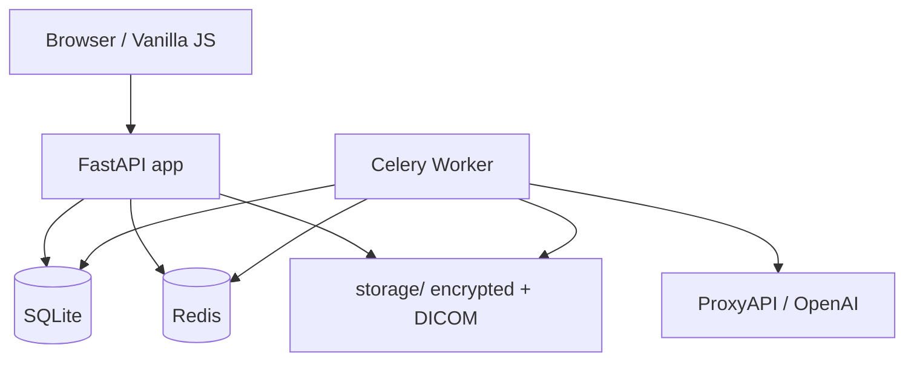

# MedInsight — Documentation

**MedInsight** is a clinical analytics platform for clinics and healthcare organizations.

## Features

- Patient and department management
- Medical document upload and parsing (PDF, DOCX)
- DICOM images: upload, viewing, analytics
- GPT risk predictions (readmission, complications)
- Dashboard and export to PDF/Excel
- Multi-tenancy, RBAC, file encryption (age)
- Telegram notifications, WebSocket, backup

## Navigation

### For clinical staff

1. [Getting started](user-guide/getting-started.md) — login, roles, interface
2. [Patients](user-guide/patients.md) — records, search
3. [Documents](user-guide/documents.md) — discharge note upload
4. [DICOM](user-guide/dicom.md) — medical images
5. [Analytics](user-guide/analytics.md) — dashboard
6. [Predictions](user-guide/predictions.md) — AI risks

### For administrators

1. [Deployment](admin-guide/deployment.md)
2. [Configuration](admin-guide/configuration.md)
3. [Backup](admin-guide/backup.md)
4. [Monitoring](admin-guide/monitoring.md)

### For developers

1. [Architecture](developer-guide/architecture.md)
2. [Database schema](developer-guide/database-schema.md)
3. [API](api/index.md)

## Architecture (overview)

## Version

Current application version: see the `APP_VERSION` variable and [Changelog](misc/changelog.md).
