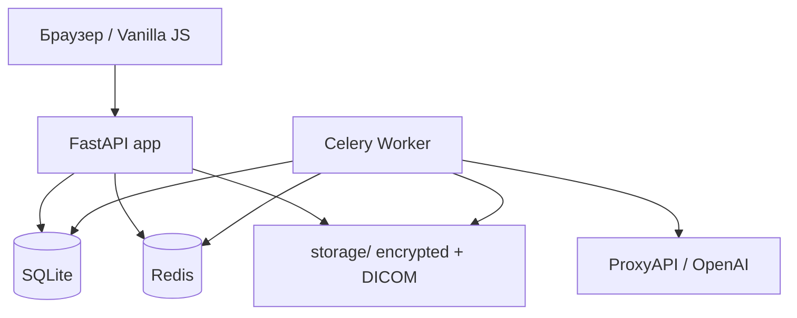

# MedInsight — документация

**MedInsight** — платформа клинической аналитики для клиник и медицинских организаций.

## Возможности

- Управление пациентами и отделениями
- Загрузка и парсинг медицинских документов (PDF, DOCX)
- DICOM-изображения: загрузка, просмотр, аналитика
- GPT-прогнозы рисков (реадмиссия, осложнения)
- Дашборд и экспорт в PDF/Excel
- Мультитенантность, RBAC, шифрование файлов (age)
- Telegram-уведомления, WebSocket, резервное копирование

## Навигация

### Для медицинского персонала

1. [Начало работы](user-guide/getting-started.md) — вход, роли, интерфейс
2. [Пациенты](user-guide/patients.md) — карточки, поиск
3. [Документы](user-guide/documents.md) — загрузка выписков
4. [DICOM](user-guide/dicom.md) — медицинские снимки
5. [Аналитика](user-guide/analytics.md) — дашборд
6. [Прогнозы](user-guide/predictions.md) — AI-риски

### Для администраторов

1. [Деплой](admin-guide/deployment.md)
2. [Конфигурация](admin-guide/configuration.md)
3. [Резервное копирование](admin-guide/backup.md)
4. [Мониторинг](admin-guide/monitoring.md)

### Для разработчиков

1. [Архитектура](developer-guide/architecture.md)
2. [Схема БД](developer-guide/database-schema.md)
3. [API](api/index.md)

## Архитектура (кратко)

## Версия

Текущая версия приложения: см. переменную `APP_VERSION` и [Changelog](misc/changelog.md).
